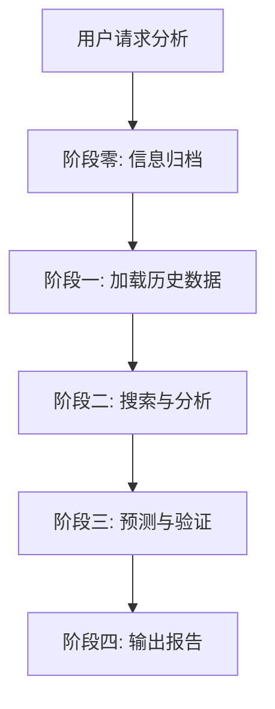

# Investment News Analysis Skill

> ⚠️ **免责声明**：本工具仅供个人学习和信息整理使用，所有分析内容均不构成任何投资建议。投资有风险，入市需谨慎，请依据自身判断做出投资决策。

## 📋 概述

这是一个专业的投资新闻收集、归档与预测分析系统。

## ✨ 核心功能

1. **全面收集**：自动搜索基金/股票相关新闻、研报、市场分析
2. **即时归档**：每次搜索后立即保存到本地，防止数据丢失
3. **智能筛选**：关联性评估，过滤低质量信息
4. **深度分析**：PESTEL + SWOT 综合分析框架
5. **多维预测**：短/中/长期走势预测，含概率分布
6. **历史验证**：验证过去预测的准确性，持续优化模型

## 🚀 快速开始

### 触发场景

当用户提到以下关键词时，此 skill 会自动激活：
- "分析我的持仓基金"
- "搜索XX基金的新闻"
- "生成投资建议"
- "进行持仓预测"
- "收集投资新闻"

### 使用示例

```
用户：分析一下嘉实新能源新材料股票A (003984)

AI：[自动应用 investment-news-analysis skill]
1. 执行4层搜索策略
2. 即时归档所有信息
3. 生成每日 summary
4. 进行 PESTEL + SWOT 分析
5. 给出短/中/长期预测
6. 验证历史预测准确性
7. 输出完整分析报告
```

## 📁 文件结构

```
investment-news-analysis/
├── SKILL.md              # 主文件（核心指令）
├── README.md             # 本文件
├── reference/            # 详细参考文档
│   ├── archiving.md      # 归档流程详解
│   └── ...               # 其他参考文档
└── examples/             # 示例
    └── sample-report.md  # 示例报告
```

## 🔧 配置说明

### 归档目录

默认归档位置：
```
日常工作流/投资新闻归档/
```

如需修改，请编辑 `SKILL.md` 中的路径配置。

### Git 提交

建议每天收盘后提交一次：
```bash
git add "日常工作流/投资新闻归档"
git commit -m "feat: 完成YYYY-MM-DD投资新闻归档"
```

## 📊 输出格式

### 1. 单条 Summary

每条高/中关联信息生成独立 Markdown 文件：
```
item_summaries/001_宁德时代Q1财报.md
```

### 2. 每日汇总 Summary

基于所有单条 summary 生成：
```
summary_2026-04-26.md
```

### 3. 完整分析报告

包含 PESTEL、SWOT、预测、验证等：
```
持仓基金投资分析与预测报告_YYYYMMDD.md
```

## ⚙️ 工作流程



**详细说明**：参见 [SKILL.md](SKILL.md)

## 🎯 关键特性

### 1. 即时归档

- ✅ 每轮搜索后立即保存
- ✅ 防止会话中断导致数据丢失
- ✅ 支持增量更新

### 2. 关联性评估

- ✅ 三等级评分体系（高/中/低）
- ✅ 自动过滤低质量信息
- ✅ 评分标准可自定义

### 3. 历史验证

- ✅ 验证过去预测的准确性
- ✅ 计算准确率和偏差
- ✅ 动态调整预测参数

## 📚 相关文档

- [主技能文件](SKILL.md) - 完整的操作指南
- [归档流程详解](reference/archiving.md) - 详细的归档步骤
- [示例报告](examples/sample-report.md) - 完整的分析报告示例

## 👤 维护者

NagaResst

---

**最后更新**：2026-04-26
